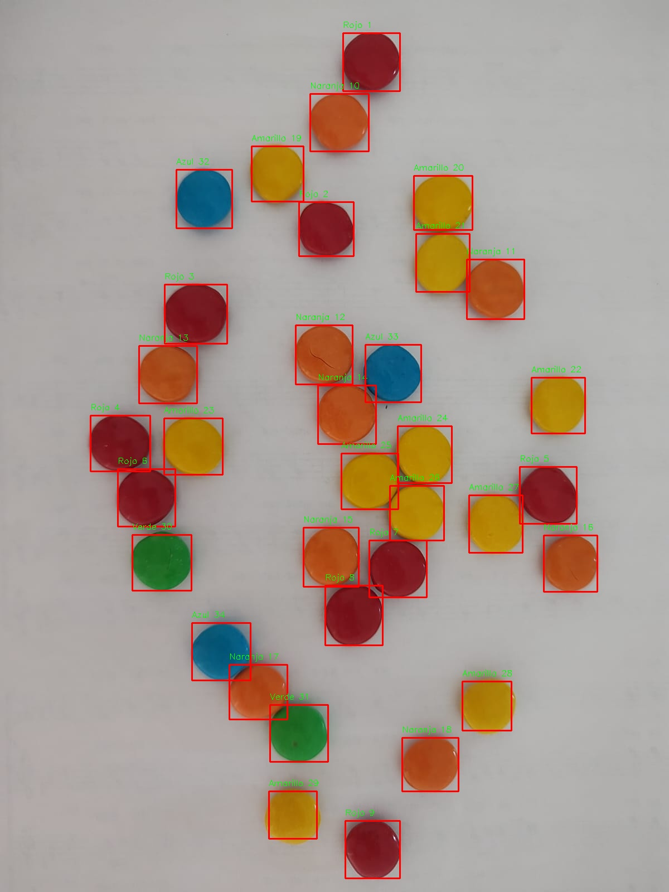
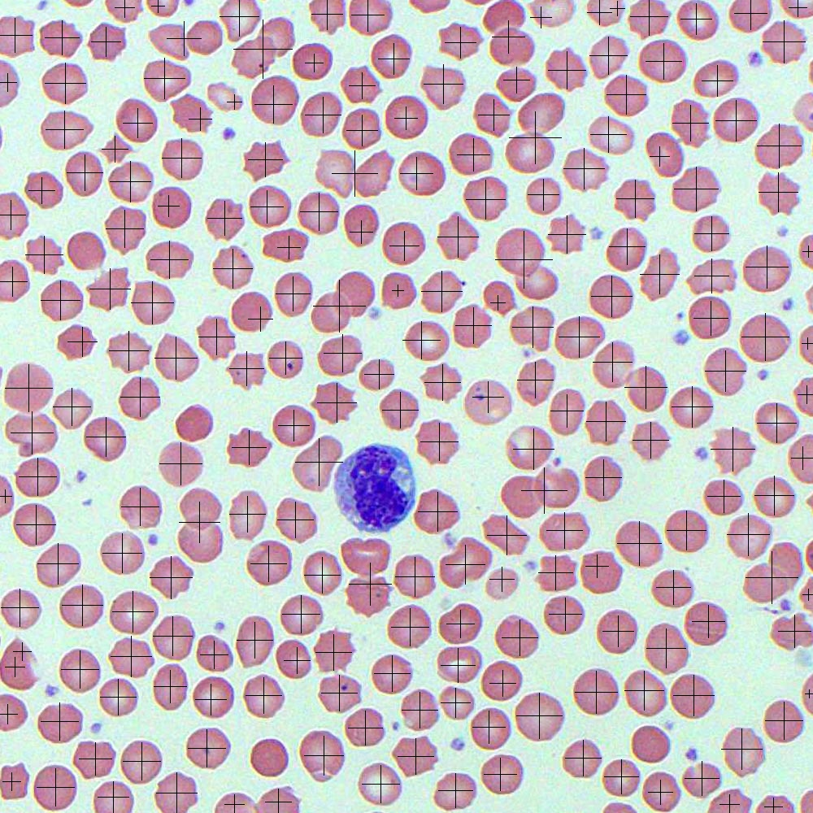

# Thresholding & Region Recognition
 TP0 de Visión Artificial

## Resumen
En este trabajo práctico se implementan algoritmos de umbralización y reconocimiento de regiones en imágenes. Se trabajó principalmente con la librería cv2 de OpenCV en Python sobre imágenes de confites de colores y células sanguíneas.

## Resultados
Reconocimiento de confites de colores:

Reconocimiento de células rojas:

## Contenido
- binarizacion_regiones.ipynb: Archivo principal donde se visualizan los enunciados y los resultados
- functions.py: Archivo con las funciones implementadas para la resolución del trabajo
- utils.py: Archivo con las funciones base, implementadas por la cátedra
- img: Carpeta con las imágenes utilizadas en el trabajo